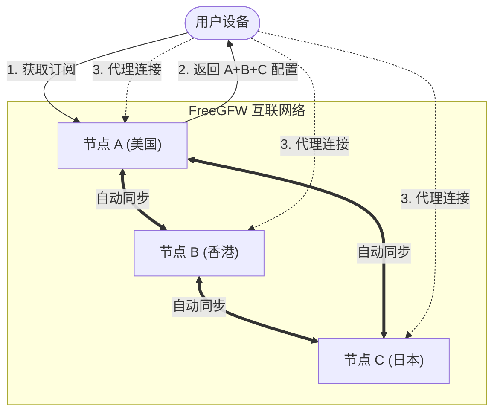

# FreeGFW

[English](README_EN.md) | [فارسی](README_FA.md) | [中文](README.md)


FreeGFW 是一个基于 [Sing-box](https://github.com/sagernet/sing-box) 和 [Xray](https://github.com/XTLS/Xray-core) 核心构建的高性能代理服务管理系统。它提供了一个现代化的 Web 界面，用于轻松部署、管理和监控各类代理协议服务。

FreeGFW 的目标是提供一个简单易用、功能强大的代理服务管理系统，让用户可以轻松部署和管理自己的代理服务。让翻墙变得简单，让普通人也可以轻松使用代理服务。为了方便普通人使用，从根本上杜绝了FreeGFW的特征，避免爆破及空间搜索引擎的扫描。

## 📸 截图预览

<div>
  
</div>

## ✨ 主要特性

- 🚀 **高性能核心**: 基于 [Sing-box](https://github.com/sagernet/sing-box) 和 [Xray](https://github.com/XTLS/Xray-core) 构建，支持最新的代理协议和特性。
- 🌐 **多协议支持**: 原生支持 VLESS (Reality/Vision), VMess, Shadowsocks, Hysteria2 等主流协议。
- ☁️ **一键集成 WARP**: 内置 Cloudflare WARP 一键配置，轻松解锁 ChatGPT 等受限服务，解决 IP 纯净度烦恼。
- 🖥️ **现代化仪表盘**: 内置 React + TailwindCSS 构建的 Web 管理界面，操作直观便捷。
- 👥 **用户管理**: 支持多用户系统，可为不同用户分配独立的配置。
- 📊 **流量监控**: 实时监控服务器的上传/下载速度，以及用户的流量使用情况。
- 🔒 **自动 HTTPS**: 集成 Let's Encrypt，自动申请和续期 SSL 证书。
- ⚡ **一键部署**: 支持 Docker 部署或直接运行二进制文件，开箱即用。

### 📦 预设节点模板

系统内置了以下多种开箱即用的配置模板，满足不同的网络环境与防封锁需求：

| 模板名称 | 核心协议 | 传输载体 | 加密 / 伪装 |
| :--- | :--- | :--- | :--- |
| **VLESS+TCP+Reality+Vision** | VLESS | TCP | Reality + Vision |
| **VLESS+XHTTP+Reality** | VLESS | XHTTP | Reality |
| **VLESS+TCP+XTLS** | VLESS | TCP | XTLS |
| **Hysteria2** | Hysteria2 | UDP | 基于 QUIC |
| **NaiveProxy** | NaiveProxy | HTTPS | TLS |
| **VMess+AEAD+TCP+TLS** | VMess | TCP | 传统 TLS |
| **VMess+AEAD+WS+TLS** | VMess | WebSocket | 传统 TLS |
| **VMess+AEAD+TCP** | VMess | TCP | AEAD |
| **Shadowsocks (AES-256-GCM)** | Shadowsocks| TCP | AES-256-GCM |

## 🚀 快速开始

### 一键安装脚本 (推荐)

自动安装 Docker 并部署 FreeGFW 容器，部署完成后会显示管理地址。

```bash
curl -fsSL https://raw.githubusercontent.com/haradakashiwa/freegfw/main/install.sh | bash
```

### 系统服务安装 (Systemd)

直接在宿主机上安装为 Systemd 服务（不依赖 Docker）。

```bash
curl -fsSL https://raw.githubusercontent.com/haradakashiwa/freegfw/main/install-systemd.sh | bash
```

### Docker 部署

```bash
docker run -d --name freegfw --network=host \
  -v "freegfw:/data" \
  ghcr.io/haradakashiwa/freegfw
```

## 📝 配置说明

- **端口配置**: 默认端口 `8080`，可通过环境变量 `PORT` 修改。
- **数据存储**: 所有数据（数据库、证书、配置文件）默认存储在 `data/` 目录下。

## 🔗 链接功能 (Link Feature)

FreeGFW 独创了「链接」功能，允许你将多个 FreeGFW 节点互联，形成一个去中心化的代理网络。

设计这个功能的初衷是，市面上的机场或者是服务提供者的特征其实已经非常明显了，我们需要绕过这个物理特性，让用户组建自己的节点代理网络本质上是去中心化的，这样可以有效降低被封锁的风险。同时，我们希望能够提供一种简单易用的方式来管理这些节点，让用户可以轻松地添加、删除、管理自己的节点。

### 核心优势

- **订阅聚合**: 用户只需订阅任意一个节点，即可获取网络中所有节点的连接信息。
- **自动同步**: 节点间自动同步服务器配置（IP、端口、协议等），无需手动更新。
- **去中心化**: 没有中心服务器，任意两点即可互联，适合组建家庭/朋友间的私有代理网络。

### 拓扑示意图



### 使用方法

1. **生成链接**: 在节点 A 的「链接管理」中点击「添加链接」，生成一个一次性的互联代码。
2. **建立连接**: 在节点 B 上输入该代码。
3. **自动互信**: 双方节点会自动交换服务器信息，并开始持续同步状态。
4. **统一订阅**: 此时，您的订阅链接中将自动包含节点 A 和节点 B 的所有可用节点。

## 🤝 贡献

欢迎提交 Issue 和 Pull Request 来帮助改进这个项目！

## 📄 许可证

GPLv3
